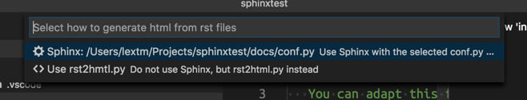
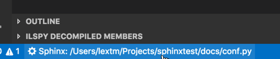

Configuration
=============

By `Lex Li`_

This article shows how to configure the extension.

Sample Project
--------------
Before digging further into the configuration, please create a sample project
first.

.. code-block:: text

    mkdir sphinxtest
    cd sphinxtest
    sphinx-quickstart
    code .

The test project has the following contents, like ``makefile``, ``conf.py``,
and build folder.

Now this project is opened in Visual Studio Code.

.. important:: You also need to install prerequisites. Please refer to
   :doc:`/articles/prerequisites` for details.

.. important:: If Microsoft Python extension is installed, please first open
   ``conf.py`` of your project. The Python extension should ask you to specify
   the Python interpreter to use (in case the machine has multiple interpreters
   installed). Your preference is saved by the Python extension, and is then
   consumed by this extension.

   If you didn't make a choice, this extension might not be able to use the
   Python interpreter you expected.

   For information, please refer to :doc:`/articles/prerequisites`.

Live Preview
------------

.. warning:: Esbonio language server must be enabled for live preview to work
   properly since release 171.0.0.

   If live preview does not work, verify if "esbonio:" is visible in the
   status bar. Read "IntelliSense" section for more details.

The keyboard shortcuts are

* ``ctrl+shift+r`` (on Mac ``cmd+shift+r``)               Preview
* ``ctrl+k ctrl+r`` (on Mac ``cmd+k cmd+r``)              Preview to Side

.. note:: To learn all keyboard shortcuts of this extension, please refer to
   :doc:`/articles/shortcuts`.

By triggering a preview, this extension might show a list of options,

Once an option is chosen, this extension is going to render the preview page
accordingly.

A status bar item is also added,

By clicking this item, the selected option is reset, and the option list is
displayed once again.

You might tune the following three settings when the extension cannot locate
the generated HTML pages.

First, a new file ``.vscode/settings.json`` needs to be created under the root
directory shown in your Explorer tab in Visual Studio Code.

Its default content is as below,

.. code-block:: json

    {
        "restructuredtext.builtDocumentationPath" : "${workspaceFolder}/_build/html",
        "restructuredtext.confPath"               : "${workspaceFolder}",
        "restructuredtext.sourcePath"             : null
    }

.. note:: All settings are set to the default values.

A file with customized values might look as below,

.. code-block:: json

    {
        "restructuredtext.builtDocumentationPath" : "${workspaceFolder}/build/html",
        "restructuredtext.confPath"               : "${workspaceFolder}/source",
        "restructuredtext.sourcePath"             : "${workspaceFolder}"
    }

Conf.py Path
::::::::::::
.. important:: For release 68.0.0 and above, this option is maintained
   automatically by the extension in most cases, so you don't need to modify it
   unless really neccessary.

   The meaning of this setting also changes. Now it stores the active preview
   option for the workspace/folder.

   * If it is ``""``, then docutils is used to render the preview page.
   * If it is a valid folder, then ``conf.py`` from that folder is used by
     Esbonio to render the preview page.
   * If it is not set, then this extension shows a list of options before
     generating a preview page.

   It is not recommended to use docutils, as it does not understand Sphinx
   specific features, and the preview pages can look differently.

This extension relies on Sphinx ``conf.py`` to generate preview pages.

Usually when a Sphinx project is opened, ``conf.py`` is located at the root in
Explorer folder, and that's the default value ``${workspaceFolder}`` of
``restructuredtext.confPath``.

If you have ``conf.py`` at another location, then ``restructuredtext.confPath``
should point to the proper path, such as
``${workspaceFolder}/source``.

.. note:: This should be an absolute path.

Source Path (172.0.0 and above)
::::::::::::::::::::::::::::::::::
The value for ``restructuredtext.sourcePath`` is only useful when the root
directory of source files does not match ``restructuredtext.confPath``.

.. note:: This should be an absolute path.
   If you don't set this setting, the value of ``restructuredtext.confPath`` is
   used instead.

IntelliSense
------------
This feature is enabled by default, though it is still experimental.

To enable/disable it at directory level, a new file ``.vscode/settings.json``
needs to be created under the root directory shown in your Explorer tab in
Visual Studio Code.

Its default content is as below,

.. code-block:: json

    {
        "restructuredtext.languageServer.disabled": false
    }

To disable IntelliSense, change the value to ``true``,

.. code-block:: json

    {
        "restructuredtext.languageServer.disabled": true
    }

You need to restart Visual Studio Code for this change to take effect.

.. note:: You can also enable it at machine level, by making this change in
   ``Preferences -> Settings``.

.. important:: The Esbonio language server requires the Python package
   ``esbonio`` to be installed. If it isn't installed yet, this
   extension will prompt and guide you through the installation.

Once configured properly, IntelliSense and live preview will both be enabled.

Linter
------
The linter support is based on ``rstcheck``, ``doc8``, and ``rst-lint``.

Linting is automatically enabled if the linters are installed. The linters
scans the opened files and highlights those lines with issues detected. The
PROBLEMS tab should also show all issues detected for easy navigation.

Executable Path
:::::::::::::::
To override automatic detection of linter modules, the following settings can
be used,

.. code-block:: json

    {
        "restructuredtext.linter.doc8.executablePath": "PathToExecutable",
        "restructuredtext.linter.rstcheck.executablePath": "PathToExecutable",
        "restructuredtext.linter.rst-lint.executablePath": "PathToExecutable"
    }

.. note:: The values should be an absolute path.
   If you don't set this setting, but set ``python.pythonPath`` separately,
   then this extension will then pick up that setting instead. Also
   ``python.pythonPath`` should be an absolute path.

.. attention:: Linters can be disabled via the new setting,
   ``restructuredtext.linter.disabledLinters``.

.. attention:: Old settings below are obsolete,

   * ``restructuredtext.linter.disabled``
   * ``restructuredtext.linter.name``
   * ``restructuredtext.linter.executablePath``
   * ``restructuredtext.linter.extraArgs``

Lint onType or onSave or not at all
:::::::::::::::::::::::::::::::::::
By default the linter will lint on the fly but can be changed to linting as
you save. Note that linting on save is most useful when auto-save is on. Use
the setting below if to change the behavior with the values onType, onSave,
and off,

.. code-block:: json

    {
        "restructuredtext.linter.run": "onType"
    }

Linter rstchck Settings
:::::::::::::::::::::::
To be added.

Linter doc8 Settings
::::::::::::::::::::
You can configure ``doc8`` `using an ini file <https://github.com/openstack/doc8#ini-file-usage>`_.
Specify the location of the ini file in ``settings.json`` as extra args.

.. code-block:: json

    {
      "restructuredtext.linter.extraArgs": [
        "--config",
        "${workspaceFolder}/doc8.ini"
      ]
    }

.. note:: This should be an absolute path.

Security
--------
This extension runs a few third-party command-line tools found from the
locations determined by the settings such as "restructuredtext.sphinxBuildPath"
or "restructuredtext.linter.executablePath". Configuring them in workspace
settings allows users to conveniently select a different set of tools based on
project's need, but also allows attackers to run arbitrary binaries on your
machine if they successfuly convince you to open a random repository. In order
to reduce the security risk, the extension reads those settings from user
settings by default. If the repository can be trusted and workspace settings
must be used, you can mark the workspace as a trusted workspace using the
"reStructuredText: Toggle Workspace Trust Flag" command.

Related Resources
-----------------

- :doc:`/articles/prerequisites`
- :doc:`/articles/shortcuts`
- :doc:`/articles/troubleshooting`
